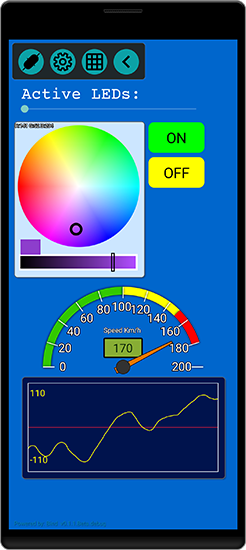
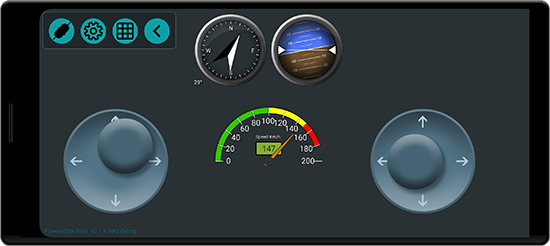

# Bind: C++ UI Toolkit for Arduino

**Bind** is a C++ UI library for Arduino, allowing developers to create interactive user interfaces seamlessly integrated into their Arduino projects. In other words, it facilitates the generation of UI components on an Android screen (BindCanvas) through MCU code. Bind allows you to display data using text, charts, gauges, street maps, and many more, and also capture user inputs through an array of *interactive elements* such as buttons, checkboxes, joysticks, sliders, and color pickers.
[Check the class documents here.](./docs/html/class_bind.html)

|  Sample app created by Bind|  Sample app created by Bind|
|:---:|:---:|


Using Bind is a breeze, requiring just three fundamental functions: `init`, `join`, and `sync`. First, use `init` to initialize the Bind interface. Then, employ `join` to associate objects with callbacks for interactive elements.  Lastly, use `sync` to synchronize with the screen and receive events.

No need to delve into data parsing or protocol handling, everything is internally managed by the Bind library. Simply define your objects, set attributes like location, size, and color, and call `bind.sync(myBindObject)` to display them on the screen.

For interactive elements like buttons or color pickers where you expect user input in your C++ code, set a callback function using `bind.join(myButton, myButtonClicked)` In this context,`myButtonClicked` is a function like:
```cpp
void myButtonClicked() {
    // Your custom logic when the button is clicked
}
```
This callback function allows you to seamlessly integrate your own logic with the user interactions, defining specific actions to be executed when the associated button is clicked.
This simplifies the process, allowing you to focus on defining your UI elements and their behavior.
## Compatibility

- **Communication Methods:** Bind currently supports Bluetooth (Classic) and Serial port (over USB) for seamless interactions. Support for Wi-Fi, BLE (Bluetooth Low Energy), and internet (MQTT) interfaces will be integrated soon. Yet, if needed, you have the flexibility to create your custom interface or module by leveraging the existing communication methods.

- **Hardware Support:**

| Board | USB | Bluetooth dongle (HC-06 or similar) | Built-in Bluetooth | Note |
|:---:|:---:|:---:|:---:|:---:|
| Avr Arduino (Uno, Pro Micro,...)| :heavy_check_mark: | :heavy_check_mark: | N/A | Works OK but has a very limited RAM. |
| ESP32 | :heavy_check_mark: | :heavy_check_mark: | :heavy_check_mark: | Board of choice. For ESP32-C3 and S3, bluetooth is not supported yet.|
| Raspberry Pi Pico W | :heavy_check_mark: | :heavy_check_mark: | :heavy_check_mark: | Works OK but Pico Bluetooth driver is not perfect yet. Pairing problems and some crash has been observed occasionally (very rare). |
| ESP8266 | :heavy_check_mark: | :heavy_check_mark: | N/A |  |
| Other Boards | :heavy_check_mark: | :heavy_check_mark: | TBD | USB serial port and external Bluetooth dongle should work with all boards. |


- **Android Compatibility:** Designed for Android 6 Marshmallow and later versions (API Level 23+), ensuring compatibility with a broad range of new devices and most of still-alive aging Android devices.

- **Screen Size:** Bind supports all screen sizes, from compact phones to larger tablets. Additionally, your Arduino code receives notifications about the screen size when users connect, allowing you to dynamically configure element positions and sizes to suit various display dimensions.

## Getting Started

 **Installation**: Include the Bind library in your Arduino IDE and install the BindCanvas app from google play on your phone to get started.


## Example Usage 1 (Using Serial port over USB for all boards)

```cpp
#include "Bind.hpp"

Bind bind;
BindButton myButton;
const int ledPin = 2;
bool led_is_on = false;

void setup() {
    pinMode(ledPin, OUTPUT);
    // Initialize the Bind object and specify the communication method (Serial) and callback function (onConnection).
    bind.init(Serial, onConnection);
    // Connect the callback functions with the Bind objects.
    bind.join(myButton, myButtonClicked);
}

/**
 * @brief Screen Setup Callback for BindCanvas.
 *
 * This callback function is automatically invoked by BindCanvas upon establishing a connection.
 */
void onConnection(int16_t width, int16_t height) {
    addButton();
}

void addButton() {
  // Set the Button's position on the screen.
  myButton.x = 30;
  myButton.y = 150;
  myButton.setlabel("LED");
  myButton.cmdId = BIND_ADD_OR_REFRESH_CMD;
  // Synchronize the myButton object with BindCanvas.
  bind.sync(myButton);
}

void myButtonClicked() {
    // Your custom logic when the button is clicked
    // For example toggle a LED:
    led_is_on = !led_is_on;
    digitalWrite(ledPin, led_is_on);
}

void loop() {
    // Regularly synchronize Bind UI events
    bind.sync();
    // Other loop logic
}
```
## Example Usage 2 (Using Bluetooth for ESP32)
```cpp
#include "BluetoothSerial.h"
#include "Bind.hpp"

BluetoothSerial SerialBT;

Bind bind;
BindButton myButton;
const int ledPin = 2;
bool led_is_on = false;

void setup() {
    pinMode(ledPin, OUTPUT);
    SerialBT.begin("BindOnESP32");
  
    // Initialize the Bind object and specify the communication method (Serial) and callback function (onConnection).
    bind.init(SerialBT, onConnection);
    // Connect the callback functions with the Bind objects.
    bind.join(myButton, myButtonClicked);
}

/**
 * @brief Screen Setup Callback for BindCanvas.
 *
 * This callback function is automatically invoked by BindCanvas upon establishing a connection.
 */
void onConnection(int16_t width, int16_t height) {
    addButton();
}

void addButton() {
  // Set the Button's position on the screen.
  myButton.x = 30;
  myButton.y = 150;
  myButton.setlabel("LED");
  myButton.cmdId = BIND_ADD_OR_REFRESH_CMD;
  // Synchronize the myButton object with BindCanvas.
  bind.sync(myButton);
}

void myButtonClicked() {
    // Your custom logic when the button is clicked
    // For example toggle a LED:
    led_is_on = !led_is_on;
    digitalWrite(ledPin, led_is_on);
}

void loop() {
    // Regularly synchronize Bind UI events
    bind.sync();
    // Other loop logic
}
```
#### Browse the example folder for more sample.

## Contribution

- Contributions are welcome! If you have ideas or improvements, feel free to open an issue or submit a pull request.