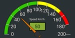
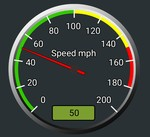

[](https://www.arduino.cc/reference/en/libraries/bind/)
[](https://www.ardu-badge.com/Bind)

# Bind: C++ UI Toolkit for Arduino

**Bind** is a C++ UI library for Arduino, allowing developers to create interactive user interfaces for their Arduino projects. Bind allows you to display data using text, charts, gauges, street maps, and many more, and also capture user inputs through an array of *interactive elements* such as buttons, checkboxes, joysticks, sliders, and color pickers.
[You can check out the complete class documentation here.](https://h1jam.github.io/Bind/class_bind.html)

Get BindCanvas Android App:<br>
<a href='https://play.google.com/store/apps/details?id=com.hjam.bindcanvas&utm_source=github&pcampaignid=pcampaignidMKT-Other-global-all-co-prtnr-py-PartBadge-Mar2515-1'>

</a>

A short YouTube video introducing Bind:

[](https://www.youtube.com/watch?v=IQnyPGmxeUg)

|  Sample app created by Bind|  Sample app created by Bind|
|:---:|:---:|

## Installation:
To install Bind in your Arduino IDE, use the **Library Manager** (available from IDE version 1.6.2). Open the IDE, go to **Tools > Manage Libraries...**, search for **_Bind_**, click install, and wait for completion. Once installed, you'll see an 'Installed' tag next to the Bind library. Close the Library Manager


Now you can find the library examples under **File > Examples > Bind**
## Usage
Using Bind is easy, requiring just three fundamental functions: `init`, `join`, and `sync`. First, use `init` to initialize the Bind interface. Then, employ `join` to associate objects with callbacks for interactive elements.  Lastly, use `sync` to synchronize with the screen and receive events.

No need to delve into data parsing or protocol handling, everything is internally managed by the Bind library. Simply define your objects, set attributes like location, size, and color, and call `bind.sync(myBindObject)` to display them on the screen.

For interactive elements like buttons or color pickers where you expect user input in your C++ code, set a callback function using their `setCallback` function, for example for buttons we can do this like: 
```myButton.setCallback(myButtonClicked)```
 In this context,`myButtonClicked` is a function like:
```cpp
void myButtonClicked() {
    // Your custom logic when the button is clicked
}
```
This callback function allows you to seamlessly integrate your own logic with the user interactions, defining specific actions to be executed when the associated button is clicked.
This simplifies the process, allowing you to focus on defining your UI elements and their behavior.
Check the library [documentation](https://h1jam.github.io/Bind/class_bind.html) or examples (under **File > Examples > Bind**) for more information.
## UI Elements
|UI element|Description|Documents|Example|
|:---:|:---:|:---:|:---:|
## UI Elements
|UI element|Description|Documents|Example|
|:---:|:---:|:---:|:---:|
|Button| The BindButton class represents a button UI element | [BindButton](https://h1jam.github.io/Bind/class_bind_button.html) | [Button.ino](https://github.com/H1Jam/Bind/blob/main/examples/ESP32%20(Bluetooth)/Basic%20Examples/Button/Button.ino)|
|Switch| Represents a toggle switch UI element|[BindSwitch](https://h1jam.github.io/Bind/class_bind_switch.html) | [Switch.ino](https://github.com/H1Jam/Bind/blob/main/examples/ESP32%20(Bluetooth)/Basic%20Examples/Switch/Switch.ino)|
|Seekbar| Represents a SeekBar object | [BindSeekBar](https://h1jam.github.io/Bind/class_bind_seek_bar.html) | [Seekbar.ino](https://github.com/H1Jam/Bind/blob/main/examples/ESP32%20(Bluetooth)/Basic%20Examples/Seekbar/Seekbar.ino)|
|Knob| Represents a knob UI element | [BindKnob](https://h1jam.github.io/Bind/class_bind_knob.html) | [DialKnob.ino](https://github.com/H1Jam/Bind/blob/main/examples/ESP32%20(Bluetooth)/Basic%20Examples/DialKnob/DialKnob.ino)|
|Chart| Represents a chart UI element | [BindChart](https://h1jam.github.io/Bind/class_bind_chart.html) | [Chart.ino](https://github.com/H1Jam/Bind/blob/main/examples/ESP32%20(Bluetooth)/Basic%20Examples/Chart/Chart.ino)|
|ColorPicker| Represents a color picker UI element | [BindColorPicker](https://h1jam.github.io/Bind/class_bind_color_picker.html) | [ColorPicker.ino](https://github.com/H1Jam/Bind/blob/main/examples/ESP32%20(Bluetooth)/Basic%20Examples/ColorPicker/ColorPicker.ino)|
|Gauge1| Represents a gauge UI element | [BindGauge](https://h1jam.github.io/Bind/class_bind_gauge.html) | [Gauges.ino](https://github.com/H1Jam/Bind/blob/main/examples/ESP32%20(Bluetooth)/Basic%20Examples/Gauges/Gauges.ino)|
|Gauge2| Represents a compact gauge UI element | [BindGaugeCompact](https://h1jam.github.io/Bind/class_bind_gauge_compact.html) | [Gauges.ino](https://github.com/H1Jam/Bind/blob/main/examples/ESP32%20(Bluetooth)/Basic%20Examples/Gauges/Gauges.ino)|
|Gauge3| Represents a simple gauge UI element | [BindGaugeSimple](https://h1jam.github.io/Bind/class_bind_gauge_simple.html) | [Gauges.ino](https://github.com/H1Jam/Bind/blob/main/examples/ESP32%20(Bluetooth)/Basic%20Examples/Gauges/Gauges.ino)|
|Heading Gauge| Represents a heading gauge UI element | [BindHeadingIndicator](https://h1jam.github.io/Bind/class_bind_heading_indicator.html) | [FlightIndicators.ino](https://github.com/H1Jam/Bind/blob/main/examples/ESP32%20(Bluetooth)/Basic%20Examples/FlightIndicators/FlightIndicators.ino)|
|Roll Pitch Gauge| Represents a roll pitch gauge UI element | [BindAttitudeIndicator ](https://h1jam.github.io/Bind/class_bind_attitude_indicator.html) | [FlightIndicators.ino](https://github.com/H1Jam/Bind/blob/main/examples/ESP32%20(Bluetooth)/Basic%20Examples/FlightIndicators/FlightIndicators.ino)|
|Joystick| Represents a joystick UI element | [BindJoystick](https://h1jam.github.io/Bind/class_bind_joystick.html) | [Joystick.ino](https://github.com/H1Jam/Bind/blob/main/examples/ESP32%20(Bluetooth)/Basic%20Examples/Joystick/Joystick.ino)|
|Street map| Represents a street map UI element | [BindMap](https://h1jam.github.io/Bind/class_bind_map.html) | [StreetMap.ino](https://github.com/H1Jam/Bind/blob/main/examples/ESP32%20(Bluetooth)/Basic%20Examples/StreetMap/StreetMap.ino)|
|Logs| Represents a terminal log UI element | [BindTerminal](https://h1jam.github.io/Bind/class_bind_terminal.html) | [Terminal.ino](https://github.com/H1Jam/Bind/blob/main/examples/ESP32%20(Bluetooth)/Basic%20Examples/Terminal/Terminal.ino)|
|TextInput| Represents a text input UI element | [BindTextInput](https://h1jam.github.io/Bind/class_bind_text_input.html) | [TextInput.ino](https://github.com/H1Jam/Bind/blob/main/examples/ESP32%20(Bluetooth)/Basic%20Examples/TextInput/TextInput.ino)|
|TextLabel| Represents a text label UI element | [BindTextLabel](https://h1jam.github.io/Bind/class_bind_text_label.html) | [TextLabel.ino](https://github.com/H1Jam/Bind/blob/main/examples/ESP32%20(Bluetooth)/Basic%20Examples/TextLabel/TextLabel.ino)|
|Panels| Represents a panel UI element | [BindRectangle](https://h1jam.github.io/Bind/class_bind_rectangle.html) | [DrawBox.ino](https://github.com/H1Jam/Bind/blob/main/examples/ESP32%20(Bluetooth)/Basic%20Examples/DrawBox/DrawBox.ino)|
|Screen Configs| Configuration settings for a BindCanvas application screen.  | [BindCanvasSettings ](https://h1jam.github.io/Bind/class_bind_canvas_settings.html) | [ScreenConfigs.ino](https://github.com/H1Jam/Bind/blob/main/examples/ESP32%20(Bluetooth)/Basic%20Examples/ScreenConfigs/ScreenConfigs.ino)|

## Compatibility

- **Communication Methods:** Bind currently supports Bluetooth (Classic and BLE), Wifi , and Serial port (over USB) for communication. Support for IoT (MQTT) interfaces will be integrated soon.

- **Hardware Support:**

| Board | USB | Bluetooth dongle (HC-06, HM-10, or similar) | Built-in Bluetooth| Wifi | Note |
|:---:|:---:|:---:|:---:|:---:|:---:|
| Avr Arduino (Uno, Pro Micro,...)| :heavy_check_mark: | :heavy_check_mark: | N/A | N/A | Works OK but has a very limited RAM. |
| ESP32 | :heavy_check_mark: | :heavy_check_mark: | :heavy_check_mark: | :heavy_check_mark: | Board of choice. (Use The Arduino ESP32 v3.0.1 or higher) |
| Raspberry Pi Pico W | :heavy_check_mark: | :heavy_check_mark: | :heavy_check_mark: | No example code is avaliable yet | Works OK but Pico Bluetooth driver is not perfect yet. Pairing problems and some crash has been observed occasionally (very rare). |
| ESP8266 | :heavy_check_mark: | :heavy_check_mark: | N/A | No example code is avaliable yet |  |
| Other Boards | :heavy_check_mark: | :heavy_check_mark: | N/A | TBD | USB serial port and external Bluetooth dongle should work with all boards. |


- **Android Compatibility:** Designed for Android 6 Marshmallow and later versions (API Level 23+), ensuring compatibility with a broad range of new devices and most of still-alive aging Android devices.

- **Screen Size:** Bind supports all screen sizes, from compact phones to larger tablets. Additionally, your Arduino code receives notifications about the screen size when users connect, allowing you to dynamically configure element positions and sizes to suit various display dimensions.

## Getting Started

 **Installation**: Include the Bind library in your Arduino IDE and install the BindCanvas app from google play on your phone to get started.


## Example Usage 1 (Using Serial port over USB for all boards)

```cpp
#include "Bind.h"

Bind bind;
BindButton myButton;
const int ledPin = 2;
bool led_is_on = false;

void setup() {
    pinMode(ledPin, OUTPUT);
    // Initialize the Bind object and specify the communication method (Serial) and callback function (onConnection).
    bind.init(Serial, onConnection);
}

/**
 * @brief Screen Setup Callback for BindCanvas.
 *
 * This callback function is automatically invoked by BindCanvas upon establishing a connection.
 */
void onConnection(int16_t width, int16_t height) {
    addButton();
}

void addButton() {
  // Set the Button's position on the screen.
  myButton.x = 30;
  myButton.y = 150;
  myButton.setlabel("Toggle LED");
  myButton.cmdId = BIND_ADD_OR_REFRESH_CMD;
  // Setting the click callback
  myButton.setCallback(myButtonClicked);
  // Synchronize the myButton object with BindCanvas.
  bind.sync(myButton);
}

void myButtonClicked() {
    // Your custom logic when the button is clicked
    // For example toggle a LED:
    led_is_on = !led_is_on;
    digitalWrite(ledPin, led_is_on);
}

void loop() {
    // Regularly synchronize Bind UI events 
    bind.sync();
    // Other loop logic
}
```
## Example Usage 2 (Using Bluetooth for ESP32)
```cpp
#include "Bind.h"
#include "BindUtil/BindOverBLE.h"

Bind bind;
BleStream bleStream;

BindButton myButton;
const int ledPin = 2;
bool led_is_on = false;

void setup() {
    pinMode(ledPin, OUTPUT);

    //Initialize the BLE device:
    bleStream.begin("YOUR_DEVICE_NAME", bind);
  
    // Initialize the Bind object and specify the communication method (Serial) and callback function (onConnection).
    bind.init(bleStream, onConnection);
}

/**
 * @brief Screen Setup Callback for BindCanvas.
 *
 * This callback function is automatically invoked by BindCanvas upon establishing a connection.
 */
void onConnection(int16_t width, int16_t height) {
    addButton();
}

void addButton() {
  // Set the Button's position on the screen.
  myButton.x = 30;
  myButton.y = 150;
  myButton.setlabel("Toggle LED");
  myButton.cmdId = BIND_ADD_OR_REFRESH_CMD;
  // Setting the click callback
  myButton.setCallback(myButtonClicked);
  // Synchronize the myButton object with BindCanvas.
  bind.sync(myButton);
}

void myButtonClicked() {
    // Your custom logic when the button is clicked
    // For example toggle a LED:
    led_is_on = !led_is_on;
    digitalWrite(ledPin, led_is_on);
}

void loop() {
    //Do something here
}
```
#### Browse the example folder for more sample.

## Contribution

- Contributions are welcome! If you have ideas or improvements, feel free to open an issue or submit a pull request.